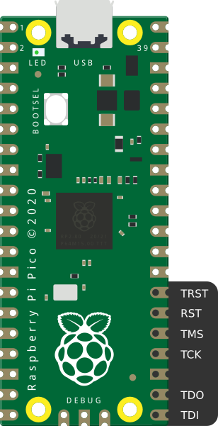
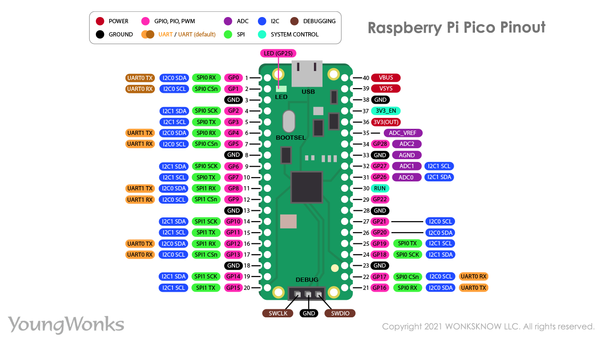
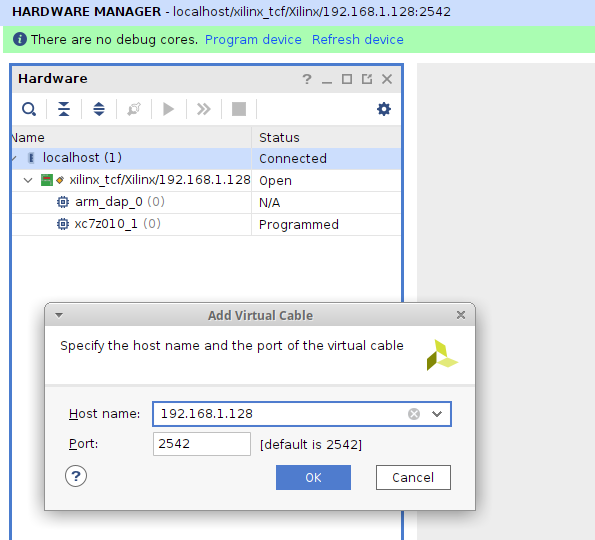

## pico-xvc

This project implements a Raspberry Pico based Xilinx Virtual Cable (XVC). It
allows using Raspberry Pico as a JTAG adapter for programming Xilinx FPGAs.

It is derived from the excellent [pico-dirtyJtag](https://github.com/phdussud/pico-dirtyJtag/) project.

A special shoutout goes to https://github.com/tom01h for crazily improving the
performance of this project - thank you!

The pinout is as follows:

| Pin name | GPIO   |
|:---------|:-------|
| TDI      | GPIO16 |
| TDO      | GPIO17 |
| TCK      | GPIO18 |
| TMS      | GPIO19 |
| GND      | Pin 23 |

Note: The Raspberry Pico is a 3.3v device. Ensure that the target device and
the Pico are electrically compatible before connecting them.





Note: This project was tested with Vivado 2021.1, Raspberry Pi Pico as the JTAG
programmer (XVC server), and EBAZ4205 'Development' FPGA Board in August 2021.

Update: This project was tested with `Vivado ML Standard 2023.1`, Raspberry Pi
Pico as the JTAG programmer (XVC server), and EBAZ4205 'Development' FPGA Board
in May 2023.


### Building pico-xvc (for Linux users)

Shortcut: Upload the pre-built `xvcPico.uf2` file to the Raspberry Pico
Board. Done - skip to the next section.

Install dependencies:

```
sudo apt install cmake gcc-arm-none-eabi libnewlib-arm-none-eabi \
  libstdc++-arm-none-eabi-newlib git libusb-1.0-0-dev build-essential \
  make g++ gcc
```

```
mkdir ~/repos
cd ~/repos

git clone https://github.com/raspberrypi/pico-sdk.git
git clone https://github.com/kholia/xvc-pico.git
```

Build the host-side daemon:

```
cd ~/repos/xvc-pico/daemon
cmake .
make
sudo ./xvcd-pico  # run on the host computer, turn on the pico board before
```

Build the Raspberry Pico's firmware:

```
cd ~/repos/xvc-pico/firmware
export PICO_SDK_PATH=${HOME}/repos/pico-sdk
cmake .
make -j4
```

### Windows Notes

Grab `xvcd-pico.exe` from the `builds` folder of this repository itself.

You need to install the `libusbK` driver with Zadig (https://zadig.akeo.ie/)
for all three `Interfaces`.

Credit goes to https://github.com/benitoss/ for these instructions.


### Usage

Select the `Add Xilinx Virtual Cable (XVC)` option in the `Hardware
Manager` in Vivado and mention the `IP address` of the host computer.




### Tips

If you see the `End of startup status: LOW` error message in Vivado, check the
FPGA power supply's voltage and current ratings.

I found `Maker Pi Pico Base` really helpful for debugging GPIO stuff.

[This URL](https://github.com/aws/aws-fpga/blob/master/hdk/docs/Virtual_JTAG_XVC.md)
says that Xilinx Virtual Cable (XVC) protocol allows (local or remote) Vivado
to connect to a target FPGA for debug leveraging standard Xilinx standard debug
cores like Integrated Logic Analyzer - ILA, Virtual Input/Output - VIO, and
others. `ILA` works fine over our Raspberry Pico JTAG adapter. Vitis stuff is
also supported.


### Rough Performance Stats ("Speed")

If cost and ease-of-availability are the driving constraints (at the cost of
speed), then this project is 'usable' and can probably suffice. If higher
programming speed is a requirement, I recommend using `xc3sprog` or
`openFPGALoader` with an FT2232H board.

This project might be one of the cheapest, most energy-efficient `Vivado-Compatible`
JTAG programmers. I use this project as my "daily driver" now ;)

Writing `ebaz4205_top.bit (371.6 KiB)` takes only ~2.5 seconds now - thanks to
tom01h. Don't `overestimate` the speed of human programmers and Vivado though
;)

Writing `corescore_0.bit (2 MiB)` which uses ~100% FPGA LEs takes around ~9
seconds.


### Flash FPGA without Vivado

```
./openFPGALoader -c xvc-client --port 2542 --file-type bin ebaz4205_top.bin
```


### USB UARTs

Connect Pico's hardware UART pins to FPGA's UART.

```
#define UART_TX_PIN 0
#define UART_RX_PIN 1
```

Set UART of FPGA to 115200 baud rate.

Note: /dev/ttyACM(n) will appear when Pico's USB is connected.


### Related Ideas / Projects

- https://github.com/kholia/xvcpi
- https://github.com/kholia/xvc-esp32
- https://github.com/kholia/xvc-esp8266
- https://github.com/phdussud/pico-dirtyJtag/
- https://github.com/kholia/Colorlight-5A-75B
- https://github.com/fusesoc/blinky#ebaz4205-development-board
- https://github.com/maxnet/pico-webserver/ approach (LWIP_SOCKET is not available yet!)
- [NEXT] Do a 100% standalone port to Pico W ;)
- [TODO] Make `BUFFER_SIZE` configurable - PRs welcome!
